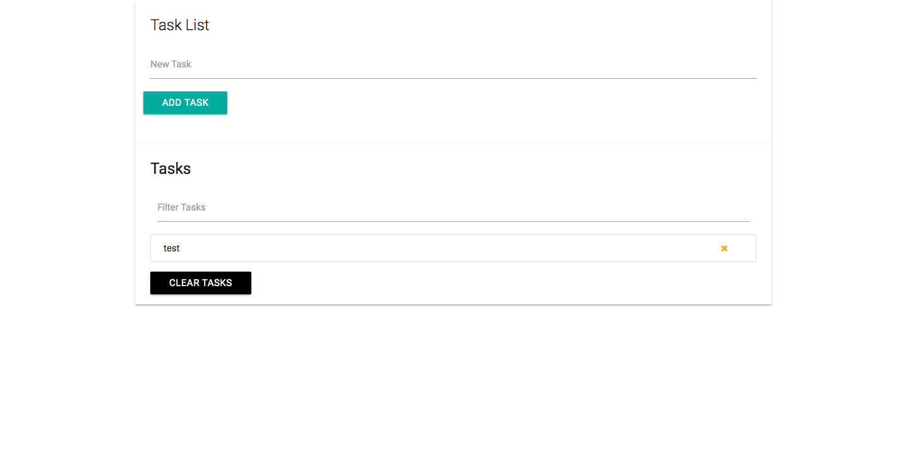
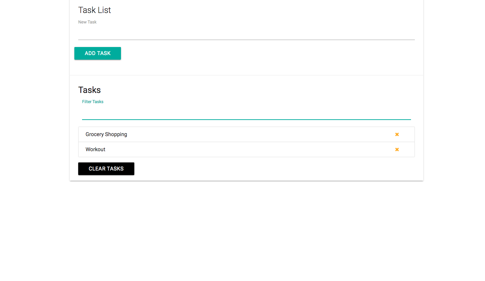
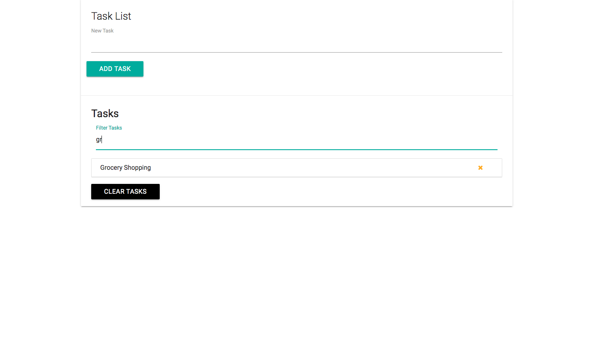
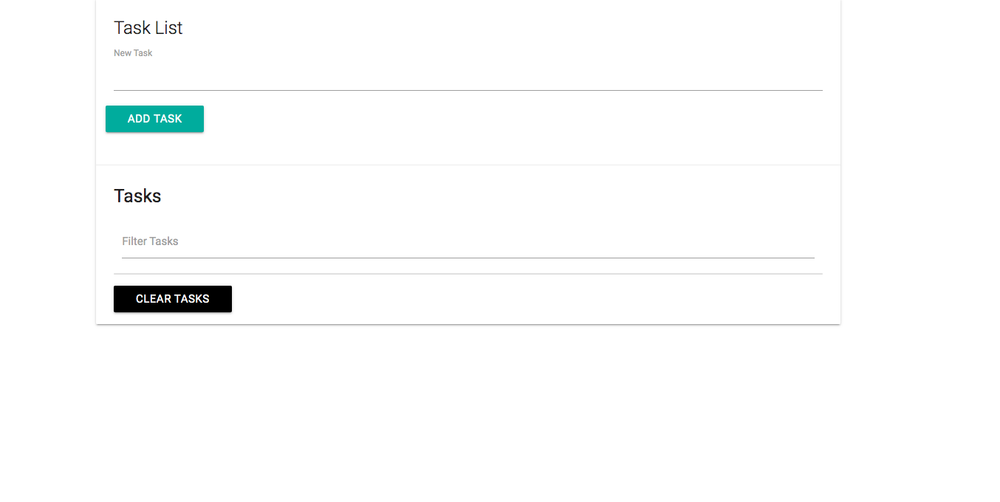

# Task-List

## Application  description:

The Task List allows users to add tasks,  filter tasks, delete selected tasks, or clear all tasks at once. The  tasks will also be stored in local storage.

 ## Click [here](https://brianlevin.github.io/Task-List/) for the live app. 
 
 This is the home page:
 
 
  
  
 The user can add tasks which will be displayed:
  
  
  Tasks can also be filtered based off of the characters typed:
     
  
  Tasks can also be deleted by clicking the X or clicking the clear tasks button:
    
   
## Libraries and Frameworks:

- HTML
- CSS
- Javascript

## Email:

bml201095@gmail.com

